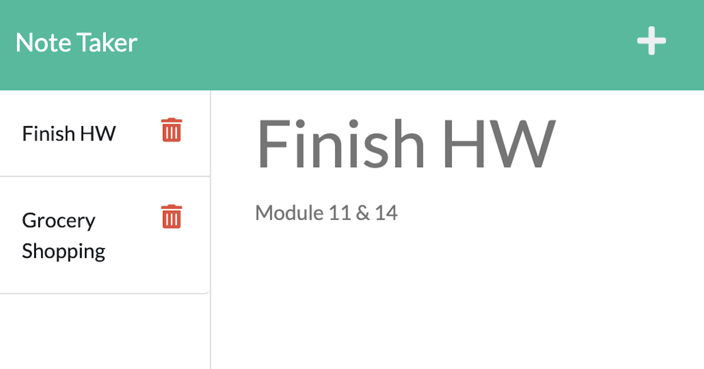

# NOTE TAKER

## Description
This application is used to create and save notes. 
#
## Table of Contents
- [Installation](#installation)
- [Heroku](#heroku)
- [Github Repository](#github-repo)
- [Screenshot](#screenshot)
- [Tests](#tests)
- [License](#license)

#
## Installation

The app is available online through the Heroku link (see below) or creating their own local repository by forking the project repository. From the command line, user will need to run "npm start" within the repo directory and navigate to their local host server at Port 3001.

### App deployed on Heroku

https://note-taker-adodt.herokuapp.com/

### GitHub Repository

Link available to fork repo for local use: [GitHub repo](https://github.com/adodt/note-taker) 

## Application Screenshot
 

#
## Tests

There are no tests for this application.

#
## License

#### MIT License [vist link](https://choosealicense.com/licenses/mit/)
Copyright 2022 

Permission is hereby granted, free of charge, to any person obtaining a copy of this software and associated documentation files (the "Software"), to deal in the Software without restriction, including without limitation the rights to use, copy, modify, merge, publish, distribute, sublicense, and/or sell copies of the Software, and to permit persons to whom the Software is furnished to do so, subject to the following conditions:

The above copyright notice and this permission notice shall be included in all copies or substantial portions of the Software.

THE SOFTWARE IS PROVIDED "AS IS", WITHOUT WARRANTY OF ANY KIND, EXPRESS OR IMPLIED, INCLUDING BUT NOT LIMITED TO THE WARRANTIES OF MERCHANTABILITY, FITNESS FOR A PARTICULAR PURPOSE AND NONINFRINGEMENT. IN NO EVENT SHALL THE AUTHORS OR COPYRIGHT HOLDERS BE LIABLE FOR ANY CLAIM, DAMAGES OR OTHER LIABILITY, WHETHER IN AN ACTION OF CONTRACT, TORT OR OTHERWISE, ARISING FROM, OUT OF OR IN CONNECTION WITH THE SOFTWARE OR THE USE OR OTHER DEALINGS IN THE SOFTWARE.